JVM:一个线程的成本  线程栈默认1MB

1.线程多了，调度成本cpu浪费

2.内存成本,线程栈默认空间是1MB

多路复用：减少系统调用

epoll：mmap存储注册的连接fd

epoll有个共享空间mmap，共享空间维护一个红黑树，调用epoll_create会这个红黑树上添加一个fd，

当红黑树的fd有事件发生时，会把这个fd添加到一个链表上，

调用epoll_ctl，会返回有事件发生的fd集合（链表）；

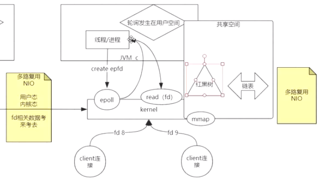

#### redis的使用

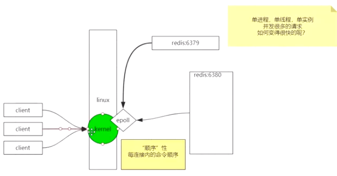

redis处理用户数据：只有一个线程去做

顺序性：每连接内的命令顺序

连接redis，

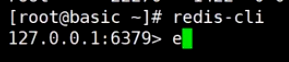

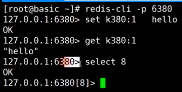

select 8：切换到8号库

redis-cli -h:帮助

redis-cli p 6380

\> set k380:1 hello  将数据存入1号库

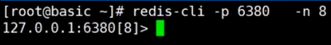连接8号库

帮助：

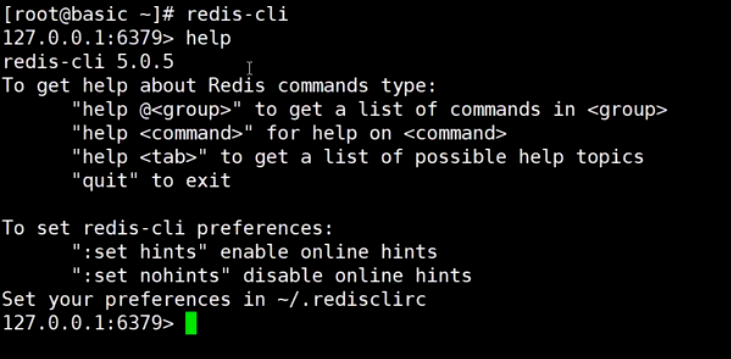

help  @generic   通用组，全局list，基本命令

keys *  :查询所有的key

flushall,flushdb:清库

help @string

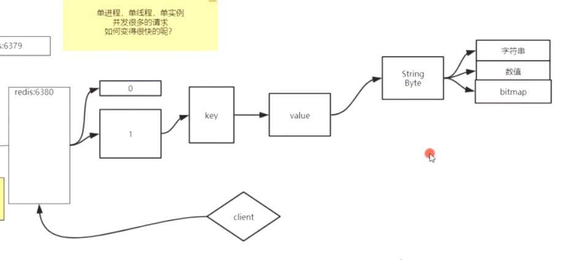

参数：nx  不存在则创建，xx存在则可以设置

mset  key1 value1  key2 value :同时设置多个

mget key1 key2:同时取出多个值

getset:取回旧值，设置新值

append:追加一个字符串

getrange:截取

setrange:修改字符串的某个部分

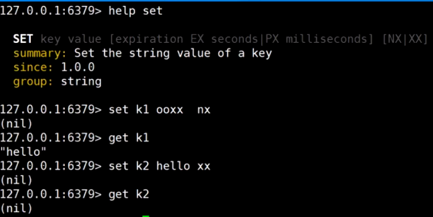

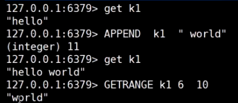

正反向索引：

正向：从左边0开始数

反向：从右边-1开始数

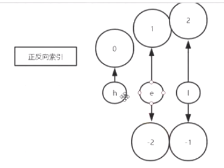

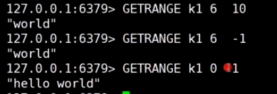

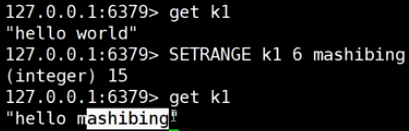

strlen k1:查询长度

字符串的常用操作：

set、get、append、setrange、getrange、strlen

全局命令：

type key  :查询key对应的value类型

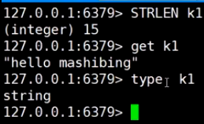

**object命令**：

object encoding k1:查询k1对应value的编码为"int";

object encoding k2:查询k1对应value的编码为"embstr";

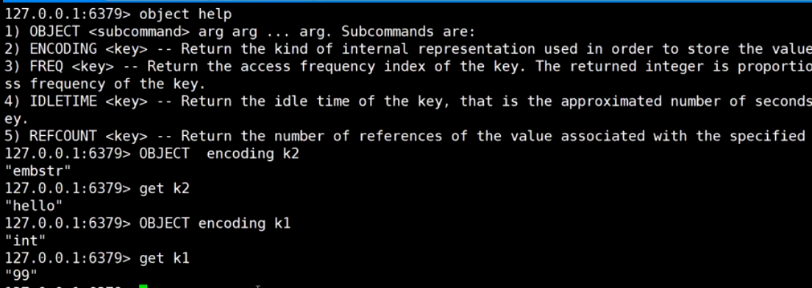

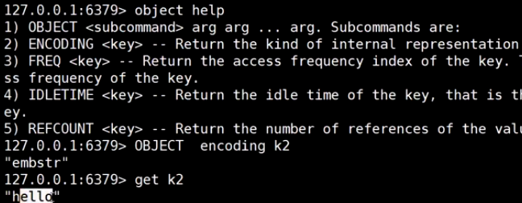

```shell
127.0.0.1:6379> set k1 2343 nx
OK
127.0.0.1:6379> set k1 2343 nx
(nil)
127.0.0.1:6379> set k1 2 nx
(nil)
127.0.0.1:6379> get k1
"2343"
127.0.0.1:6379> set k2 hello xx
(nil)
127.0.0.1:6379> get k2
(nil)
127.0.0.1:6379> append k1 world
(integer) 9
127.0.0.1:6379> get k1
"2343world"
127.0.0.1:6379> getrange k1 4 -1
"world"
127.0.0.1:6379> getrange k1 3 -1
"3world"
127.0.0.1:6379> getrange k1 3 10
"3world"
127.0.0.1:6379> getrange k1 3 11
"3world"
127.0.0.1:6379> setrange k1 4 mashibing
(integer) 13
127.0.0.1:6379> get k1
"2343mashibing"
127.0.0.1:6379> strlen k1
(integer) 13
127.0.0.1:6379> type k1
string
127.0.0.1:6379> set k2 1
OK
127.0.0.1:6379> type k2
string
127.0.0.1:6379> incr k2
(integer) 2
127.0.0.1:6379> type k2
string
127.0.0.1:6379> get k2
"2"
127.0.0.1:6379> object encoding k1
"raw"
127.0.0.1:6379> object encoding k2
"int"
127.0.0.1:6379> set k3 2
OK
127.0.0.1:6379> object encoding k3
"int"
127.0.0.1:6379> append k3 5
(integer) 2
127.0.0.1:6379> get k3
"25"
127.0.0.1:6379> object encoding k3
"raw"
127.0.0.1:6379> incr k3
(integer) 26
127.0.0.1:6379> object encoding k3
"int"
127.0.0.1:6379> set k4 hello
OK
127.0.0.1:6379> object encoding k4
"embstr"
127.0.0.1:6379> append k4 world
(integer) 10
127.0.0.1:6379> object encoding k4
"raw"
```


incrby k1 22:给k1加22；

decrby k1 22  :给k1减22；

incrbyfloat k1 0.5:给k1加上一个浮点数0.5;

```shell
127.0.0.1:6379> incrby k5 22
(integer) 22
127.0.0.1:6379> get k5
"22"
127.0.0.1:6379> decrby k5 21
(integer) 1
127.0.0.1:6379> get k5
"1"
127.0.0.1:6379> incrbyfloat k5 0.2
"1.2"
127.0.0.1:6379> get k5
"1.2"
```


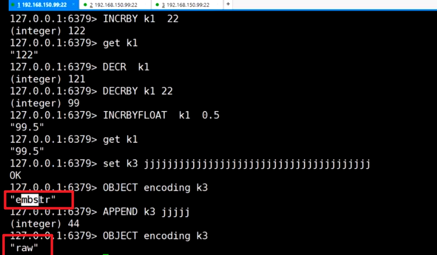

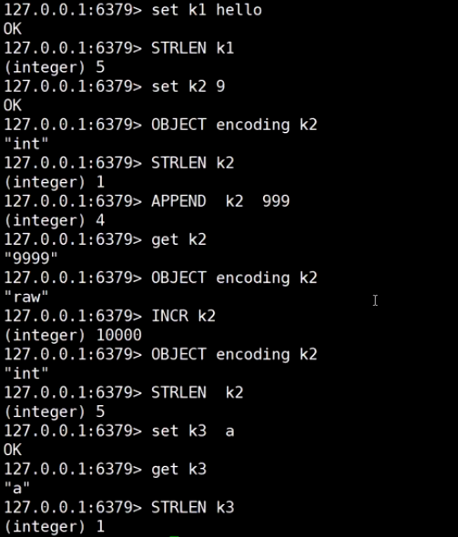

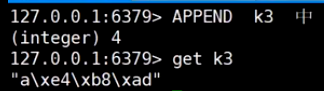

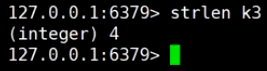

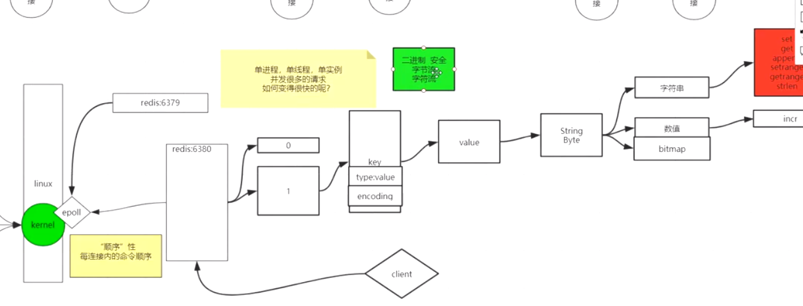

##### redis二进制安全

redis存储string类型是按照字节存储的，客户端要set一个key，也是先转化为字节数组，然后发送给redis进行存储

encoding: redis存储字符串的key时，使用encoding来记录字符串的实际类型，默认是string，如果发现是int类型，则记录为int，下次对int类型进行算术运算时不需要再检查类型，可以提高效率

```
redis中的二进制安全：
二进制安全
```

C字符串中的字符必须符合某种编码（比如ASCII），并且除了字符串的末尾之外，字符串里面不能包含空字符，否则最先被程序读入的空字符将被误认为是字符串结尾，这些限制使得C字符串只能保存文本数据，而不能保存像图片、音频、视频、压缩文件这样的二进制数据。

举个例子，如果有一种使用空字符来分割多个单词的特殊数据格式，如图2-17所示，那么这种格式就不能使用C字符串来保存，因为C字符串所用的函数只会识别出其中的"Redis"，而忽略之后的"Cluster"。

 

虽然数据库一般用于保存文本数据，但使用数据库来保存二进制数据的场景也不少见，因此，为了确保Redis可以适用于各种不同的使用场景，SDS的 API都是二进制安全的（b[](http://s9.51cto.com/wyfs02/M00/2D/24/wKioL1OVEmig6d0eAAAm1wqt_cU234.jpg)inary-safe），所有SDS API都会以处理二进制的方式来处理SDS存放在buf数组里的数据，程序不会对其中的数据做任何限制、过滤、或者假设，数据在写入时是什么样的，它被读 取时就是什么样。

这也是我们将SDS的buf属性称为字节数组的原因——Redis不是用这个数组来保存字符，而是用它来保存一系列二进制数据。

例如，使用SDS来保存之前提到的特殊数据格式就没有任何问题，因为SDS使用len属性的值而不是空字符来判断字符串是否结束，如图2-18所示。

[](http://s8.51cto.com/wyfs02/M02/2D/23/wKiom1OVEp3z4iJfAAA6uSyKluk863.jpg)

通过使用二进制安全的SDS，而不是C字符串，使得Redis不仅可以保存文本数据，还可以保存任意格式的二进制数据。

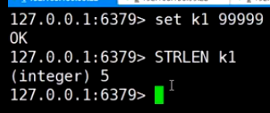

redis是按字节对字符串进行存储，如果有数值计算，

需要类型转换，

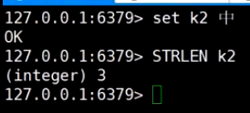

将xshell的编码由utf8改成gbk，

然后执行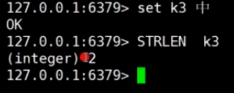

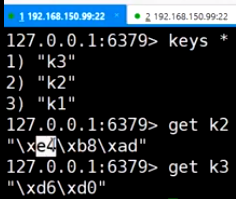

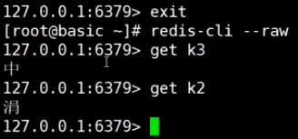

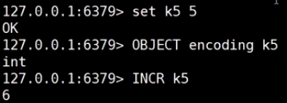

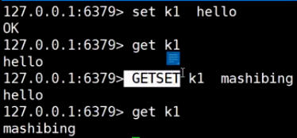

GETSET 和使用GET、SET的对比：减少一次网络通信

MSETNX:同时设置多个key，可以保证原子性，要么同时成功，要么同时失败

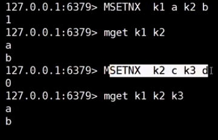

##### bitmap

help setbit ：设置二进制位的数值

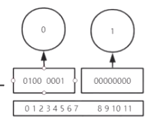

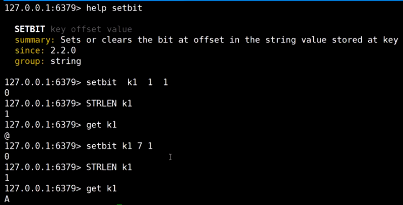

```
127.0.0.1:6379> help setbit

  SETBIT key offset value
  summary: Sets or clears the bit at offset in the string value stored at key
  since: 2.2.0
  group: string

127.0.0.1:6379> flushall
OK
127.0.0.1:6379> keys *

127.0.0.1:6379> setbit k1 1 1
0
127.0.0.1:6379> get k1
@
127.0.0.1:6379> setbit k1 7 1
0
127.0.0.1:6379> get k1
A
127.0.0.1:6379> strlen k1
1
127.0.0.1:6379> setbit k1 9 1
0
127.0.0.1:6379> strlen k1
2
127.0.0.1:6379> get k1
A@
```


man ascii:a查看asscii码

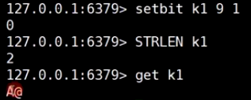

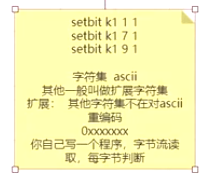

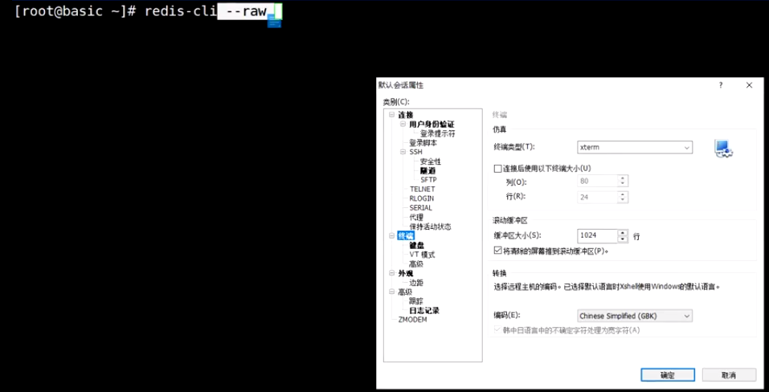

--raw：尝试使用客户端的编码显示字符

help @string

help bitpos:获取二进制位第一次出现的位置

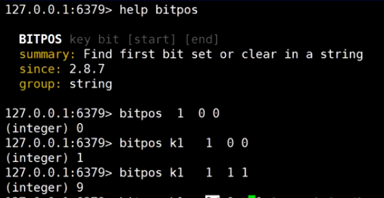

bitcount: 统计二进制位中1出现的次数

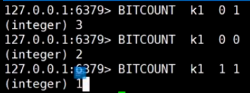

bitop:按位操作多个key，将结果放入目标key

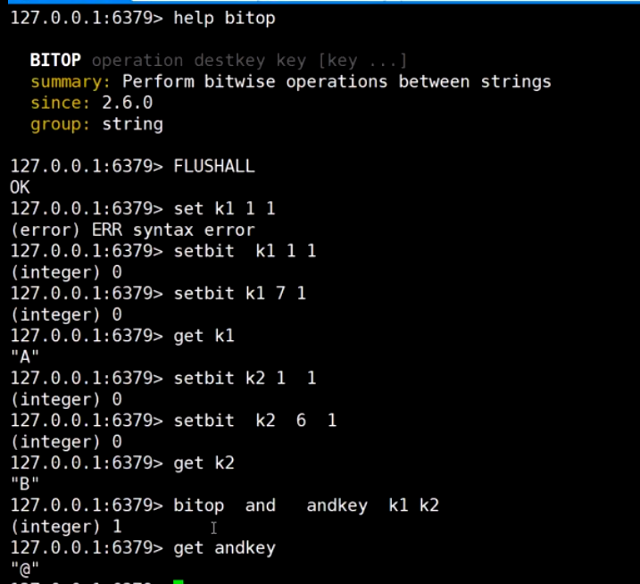

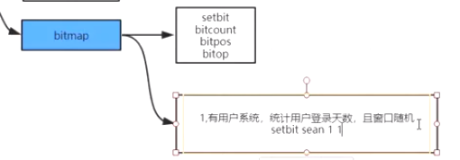

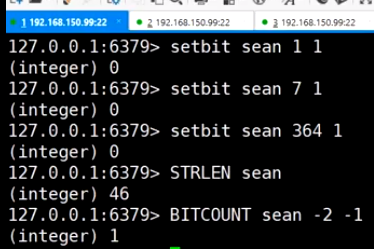

统计一段时间的活跃用户数：

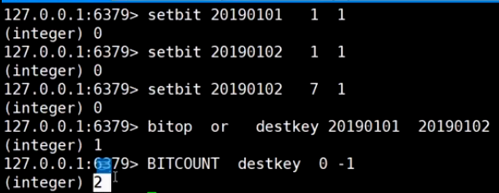

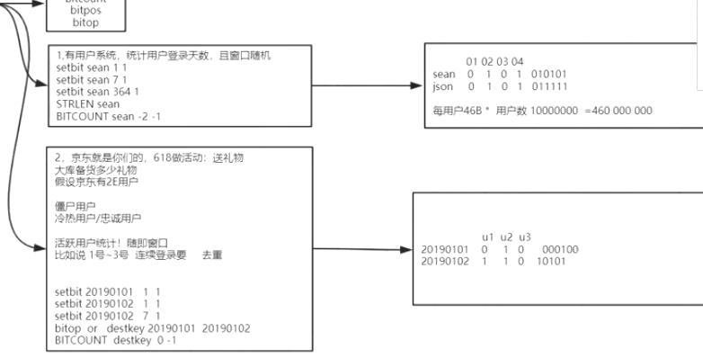

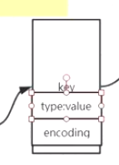

redis的key是对象，包括key，type，encoding

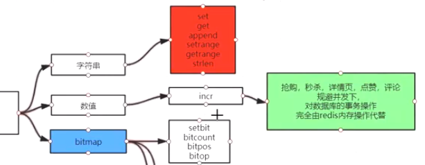

数值操作：抢购，秒杀允许结果有误差，对金融数据不适合使用redis


