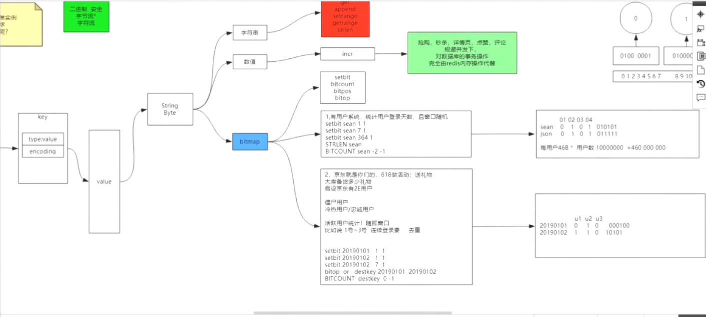

##### list

链表：双向链表

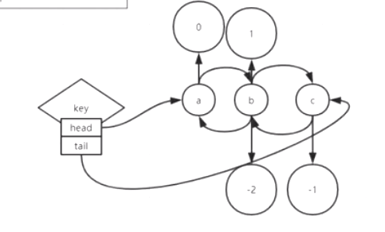

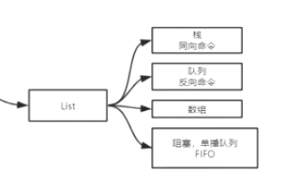

key：对象中存储了head、tail；

```txt
help @list 查看list帮助文档
lpush :从链表的左边开始放
rpush:从链表的右边开始放
lpop :从左边弹出一个元素
lrange: 查看指定范围的数据
LTRIM:截取list集合的指定范围元素，其他元素删除
lindex:根据索引取出元素
lset :修改指定位置的元素
LINSERTl   key after oldvalue newvalue:在某个元素之后插入数据
LINSERTl   key before oldvalue newvalue:在某个元素之前插入数据
```


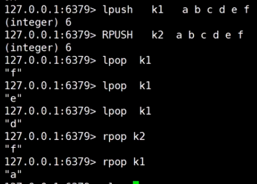

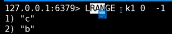

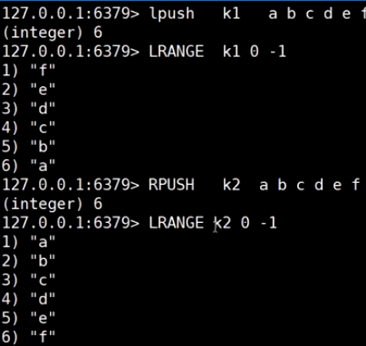

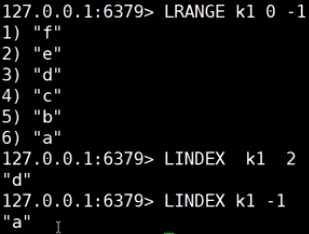

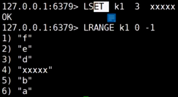

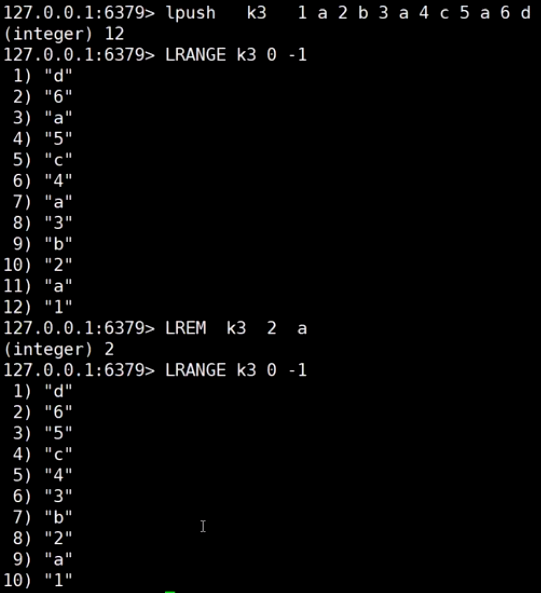

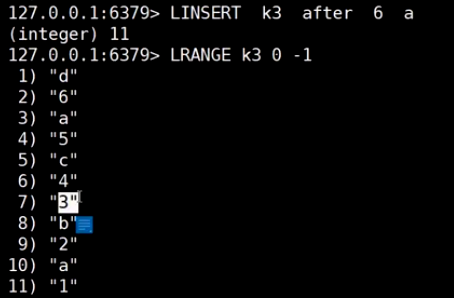

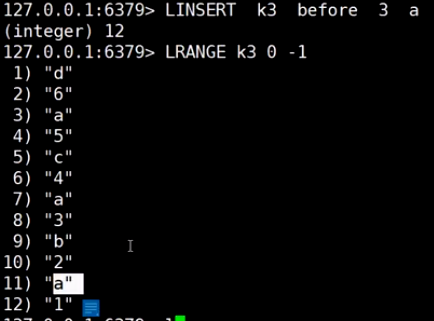

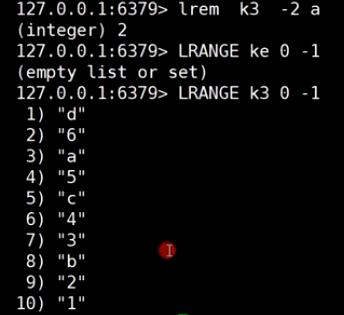

```
list实现阻塞队列
BLPOP:阻塞弹出元素，实现阻塞队列，可以设置阻塞时间,阻塞时间设置为0表示永久阻塞
```

开启三个客户端，

第一个和第二个客户端，输入
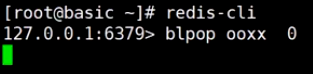

客户端1和客户端2都被阻塞住，等待数据返回，

客户端3 push一个数据，

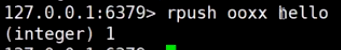

客户端1此时获取到数据：

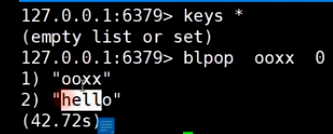

客户端2继续阻塞，

然后客户端3继续push一个数据：

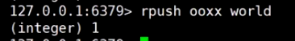

客户端2获取到数据：

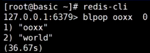

##### hash

keys sean*配合mget可以获取sean的所有属性,但**keys查找成本太高**

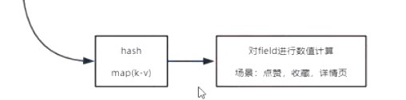

```
hset k1 feild value:设置某个key的属性和属性值
hmget k1 feild1 feild2  获取key的多个属性值
hgetall k1 获取key的所有属性和值
hkeys k1 列举key的所有属性
hvals k1 列举key的所有值
hlen k1 求key的属性个数
hincrbyfloat:  增加hash的某个key对应的value值，操作类型为浮点型
hincrby: 增加hash的某个key对应的value值，操作类型为整型
```


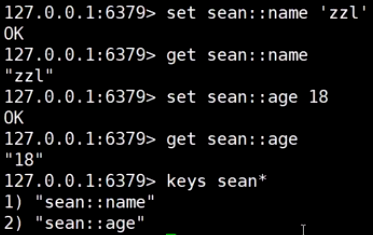

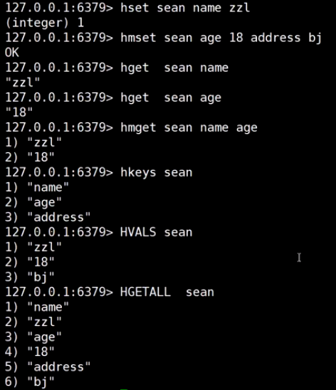

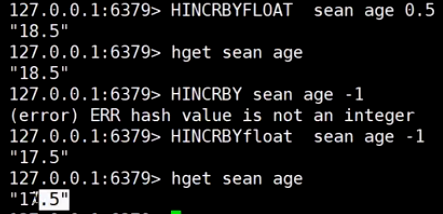

##### SET

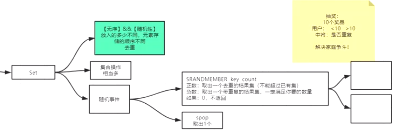

```
help @set 查看set帮助文档
srem: 移除元素
SMEMBERS key:获取所有的value，会影响性能
sinter：取多个key的交集
sinterstore destkey  key1 key2:取key1和key2的交集，并存入destkey
sunion：取并集
sdiff:取差集，注意：key的顺序会影响结果

srandmember:取多个随机值
srandmember key count ，count如果是正数，取出一个去重的结果集(不能超过已有集合)，负数：取出一个允许带重复的结果集，一定满足你要的数量，如果是0，不返回
应用场景：抽奖，解决家庭争斗
set集合里存放人，如果抽取正数，会抽取不重复的元素，如果是负数则可能出现重复的元素
spop key :随机弹出一个值
scard k1: 获取set集合元素的个数
```

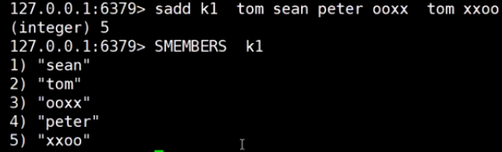

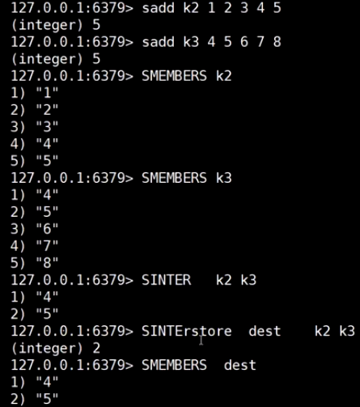

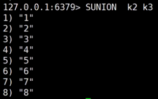

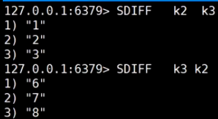

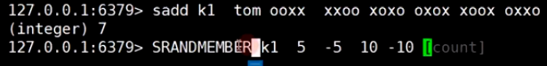

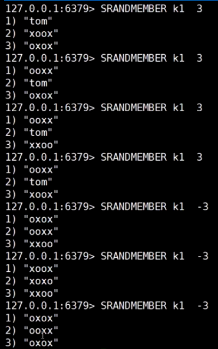


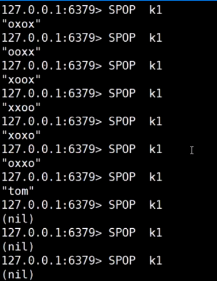

##### sorted set

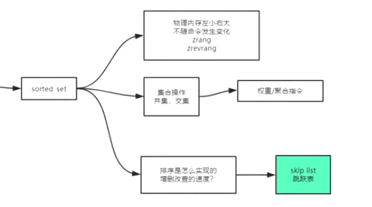

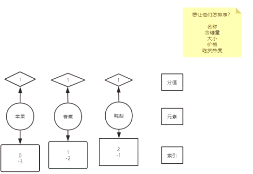

```
物理内存存储顺序：按照score左小右大的顺序存放，不会随着命令发生变化
zunionstore:取sortedset的并集
zunionstore dest 2 k1 k2 合并k1和k2的元素，并将重复的元素的分数累加
zunionstore dest2 2 k1 k2 weights 1 0.5 合并k1和k2的元素，将重复的元素的分数乘以相应的权重并累加
zadd k1 socre1 value1 score2 value2 :往集合里面添加元素 
zcard k1:获取集合的元素个数
zcount k1 50 80:求分数位于50-80之间的元素的个数
zrange k1 0 -1:获取集合的所有元素
zrange k1 0 -1 withscores:获取集合的所有元素,包含分数，顺序为分数从低到高
zrevrange k1 0 -1 withscores 按照分数从高到低返回所有的元素和分数
zincrby key score value:给元素增加分数
zrank k1 banna：获取指定元素的排名
应用场景：
场景：歌曲排行榜
点击量：开始为0，当用户访问时，更新点击量的分数
```


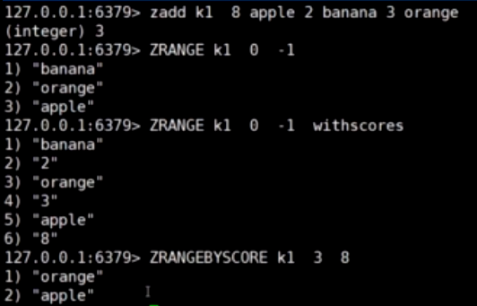

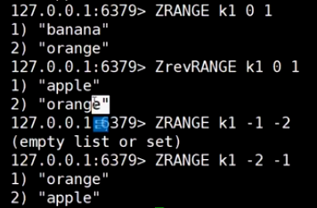

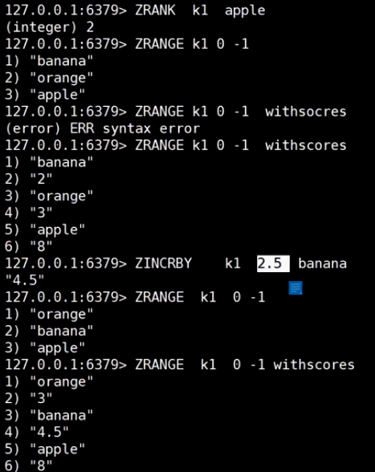

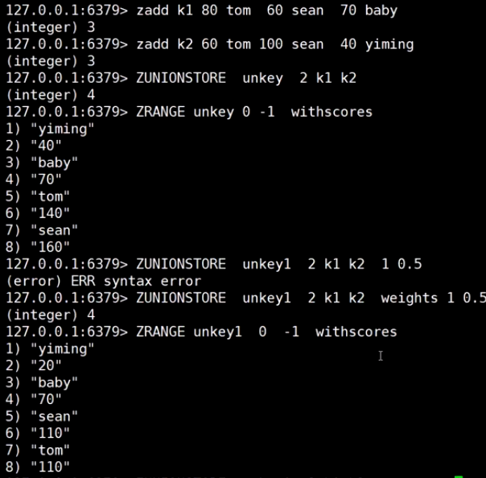

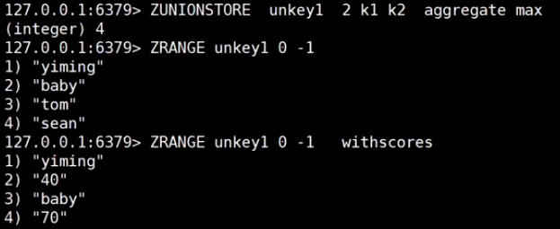

**sorted set 底层原理**

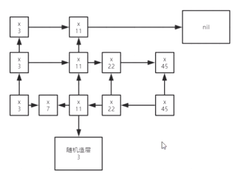

```
skip list:跳跃表：类平衡树
当数据量很大，增删改查的平均值相对最优
```

