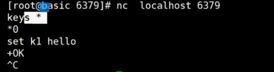

```
cd /etc/conf/redis/6379 将redis注册为系统服务后，redis启动配置目录
```

#### 使用socket和redis建立连接，可以直接发送命令执行redis操作



通过管道的方式一次性发送多个命令，echo将多个命令通过管道交给nc服务发送给redis服务器执行


#### redis可以实现从文件中批量导入数据


#### redis实现发布订阅

```
help @pubsub
publish channel msg 往channel中发布消息
subscribe channel 订阅channel的消息
```


sorted set存放近三天的数据，可以使用时间作为分数，这样可以自动按照时间进行排序，这样可以按照时间戳删除更早的数据，或者是保留多少条记录

#### redis事务

mutil(开始事务)，exec(执行事务)，discard(取消事务)，watch（监控数据，实现乐观锁）是redis事务相关的命令

使用watch可以监控数据的变化，如果在执行exec时候发现数据被更改了，可以撤销后续命令的执行

```
help @transactions
```


客户端1：


客户端2：


watch:监控一个或多个key的值，如果发生变化，则撤销事务


#### 布隆过滤器


布隆过滤器的作用：当使用redis缓存数据，用户发过来大量的请求并且无法命中缓存时，会造成缓存穿透，导致数据库产生很大的访问压力，布隆过滤器通过bitmap结合布隆算法可以拦截大量的无效的请求


```
安装布隆过滤器扩展库
redis版本要求： Redis v4.0 或更高
访问redis.io
进入modules
访问redisBloom的GitHub
https://github.com/RedisBloom/RedisBloom
wget https://github.com/RedisBloom/RedisBloom/archive/refs/tags/v2.2.5.zip --no-check-certificate
unzip master.zip
cd RedisBloom-master/
make  构建
带布隆过滤器启动redis
redis-server --loadmodule /path/to/redisbloom.so
```

```
redis-cli
bf.add oxx abc
bf.exits oxx abc 返回1
bf.extis oxx adfdsf 返回0
如果发生穿透了，client，增加redis中的key，value标记
数据库增加了元素
完成元素对bloom的添加
```


* 作业：了解过滤器，bloom布隆过滤器，counting bloom，cukcoo布谷鸟过滤器


* redis作为数据库/缓存的区别


```
redis将bloom.so库添加到配置文件redis.conf
还可以将定制化的配置通过include引入redis.conf中
bind 192.168.1.01 绑定ip地址，只允许这些ip地址才能访问
procted-mode yes 是否开启保护模式，是否允许远程访问
daemonize yes 是否是后台服务模式
pidfile /var/run/redis_6379.pid redis启动后的进程pid文件
loglevel  配置日志级别
logfile   配置日志文件目录
database 16 redis数据库的数量
requirepass foobared 设置密码
rename-commond config "" 重命名命令名称,比如flushall，flushdb
maxclients 100000 允许的最大客户端连接数
maxmemory <byte> redis可以使用的最大内存，最好在1G-10G之间，当内存不够用时会剔除一些数据
maxmemory-policy novevicition 当内存不够用时会剔除数据策略

```


```
设置过期时间：
set k1 aaa ex 20
ttl k1 查看key的存活时间
expire k1 30 延迟过期时间
expireat k1 timestamp 设置key在某个时间点过期
```


过期判定原理：

1.被动访问时判定

2.周期轮询判定(增量)

目的是稍微牺牲下内存，但是保住了redis性能


缓存常见问题：

击穿，雪崩，穿透，一致性(双写)

* 缓存击穿

缓存穿透是指缓存和数据库中都没有的数据，而用户不断发起请求，会导致数据库压力过大。

* 缓存雪崩

 缓存雪崩是指缓存中数据大批量到过期时间，而查询数据量巨大，引起数据库压力过大甚至down机。

和缓存击穿不同的是，缓存击穿指并发查同一条数据，缓存雪崩是不同数据都过期了，很多数据都查不到从而查数据库。

* 缓存穿透

缓存击穿是指缓存中没有但数据库中有的数据（一般是缓存时间到期），这时由于并发用户特别多，同时读缓存没读到数据

