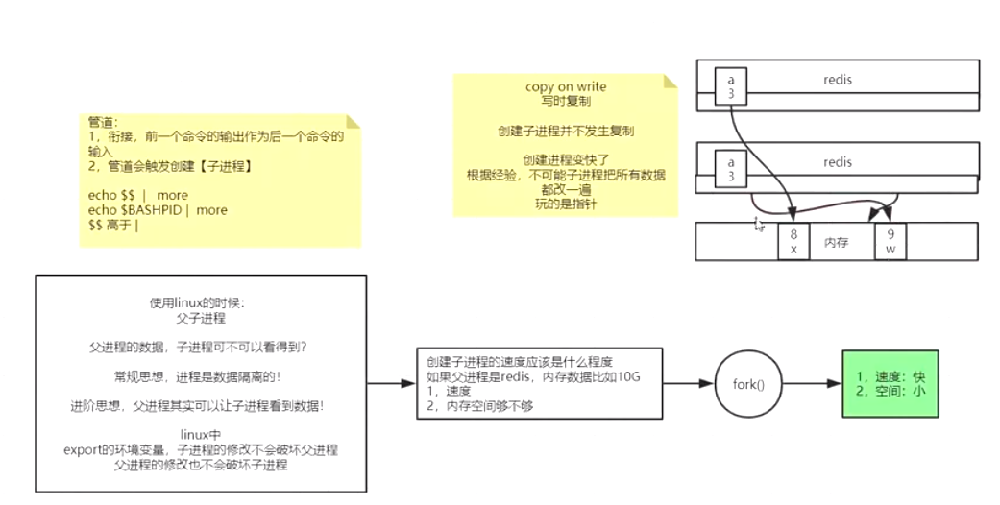
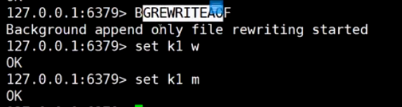

redis：用作缓存数据可以丢，用做数据库数据绝对不能丢的 (要求速度快)

redis+mysql > 缓存和数据库数据一致性(速度+持久性，掉电易失)


存储层：1.快照/副本RDB  2.日志AOF

* 管道：

  > 1.衔接，上一个命令的输出作为下一个命令的输入
  >
  > 2.管道会触发创建【子进程】

$$的优先级高于管道|,进程是数据隔离的，默认情况下子进程看不到父进程的数据

父进程使用export命令可以让子进程看到父进程的数据,在子进程中修改父进程的变量不会影响父进程变量的值，父进程修改变量的值也不会影响子进程变量的值


编辑test.sh:

执行test.sh,带上&符号表示后台执行

```
[root@hgq soft]# chmod +x test.sh
[root@hgq soft]# ll
总用量 2412
drwxrwxr-x. 7 root root    4096 6月   1 22:03 redis-6.2.4
-rw-r--r--. 1 root root 2457940 6月   1 22:16 redis-6.2.4.tar.gz
-rwxr-xr-x. 1 root root      71 7月  11 00:04 test.sh
[root@hgq soft]# ./test.sh &
```





```
daemonize no 改成前端运行
#logfile /var/log/reis_6379.log 注释掉日志配置，可以将日志输出在控制台
```


```
rdb配置：
save "" 禁用快照
save 900 1 满足900秒至少有一个key改变保存一次
save 300 10 满足300秒至少有10个key改变保存一次
save 60 10000 满足60秒至少有10000个key改变保存一次
dbfilename dump.rdb rdb快照文件名
客户端命令：
手动执行save，阻塞客户端请求，用于关机维护
bgsave：fork一个子进程来保存快照

 ./redis-check-rdb /var/lib/redis/6379/dump.rdb 使用redis-check-rdb工具分析rdb文件
```

```
aof配置
appendonly yes 开启aof模式
appendfilename "appendonly.aof" aof文件名

appendfsync always 总是flush写buffer，将buffer写入磁盘
appendfsync everysec 每秒flush写bufferr，将buffer写入磁盘
appendfsync no 不去flush写buffer，由buffer满了自动触发写磁盘操作

auto-aof-rewrite-percentage 100 aof重写的比例为100%
auto-aof-rewrite-min-size 64mb aof重写的最小size为64M，重写后redis会记录当前的aof文件大小，在这个文件的基础上再达到64M会再次触发重写
no-appendfsync-on-rewrite no
```

```
redis客户端执行如下命令：
127.0.0.1:6379> flushdb
OK
127.0.0.1:6379> set k1 sfsdf
OK
127.0.0.1:6379> set k1 sf
OK
127.0.0.1:6379> set k1 haha
OK
127.0.0.1:6379> 

aof文件内容：
*后面的数字代表命令由几个元素组成，$后面的数字代表元素的长度
*2  
$6
SELECT
$1
0  # select 0 选择0号库
*3
$3
set
$2
k1
$5
sfsdf  # set k1 sfsdf
*3
$3
set
$2
k1
$2
sf  # set k1 sf
*3
$3
set
$2
k1
$4
haha # set k1 haha
```

```
重写aof：
127.0.0.1:6379> set k1 a
OK
127.0.0.1:6379> set k1 b
OK
127.0.0.1:6379> set k1 c
OK
127.0.0.1:6379> bgrewriteaof 
Background append only file rewriting started
127.0.0.1:6379> set k1 d
OK
127.0.0.1:6379> set k1 e
OK
127.0.0.1:6379> 

aof文件内容：
REDIS0009ú      redis-ver^E6.2.4ú
redis-bitsÀ@ú^EctimeÂ#Ùé`ú^Hused-memÂx<9b>^M^@ú^Laof-preambleÀ^Aþ^@û^A^@^@^Bk1^Acÿ3립È<97><9b>Ì*2^M
$6^M
SELECT^M
$1^M
0^M
*3^M
$3^M
set^M
$2^M
k1^M
$1^M
d^M
*3^M
$3^M
set^M
$2^M
k1^M
$1^M
e^M
```

```
aof-use-rdb-preamble yes 开启aof与rdb混合模式
清空rdb日志和aof日志文件
```


aof重写后，命令被合并了：


aof还没有发生重写：


执行重写，发现日志文件变成rdb和aof混合体：





注意：误操作比如执行了flushall,如果发生了BGREWRITEAOF，则aof日志文件被重写了，数据无法恢复


