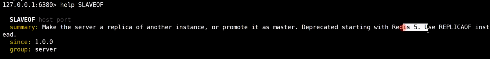

```
单机redis存在的问题：
1.单点故障
2.容量有限
3.压力
```


```
名词：
主从：master和slave，客户端可以访问master和slave,企业中偏向主从
主备：master和backup，客户端只能访问master
```

保证主机的高可用：通过集群监控方式判断主机是否可用，主机挂了，则自动故障转移至备份机上


CAP原则又称CAP定理，指的是在一个分布式系统中，一致性（Consistency）、可用性（Availability）、分区容错性（Partition tolerance）。CAP 原则指的是，这三个要素最多只能同时实现两点，不可能三者兼顾。

使用redis安装包目录下的utils/install_server.sh安装redis服务：6379,6380,6381,将redis注册为服务

```
# 在/usr/local/bin/目录下创建软链接，让redis-cli指令可以在任意目录下直接使用
ln -s /usr/local/redis/bin/redis-cli /usr/local/bin/redis-cli
ln -s /usr/local/redis/bin/redis-server /usr/local/bin/redis-server
```

service redis stop停止redis服务


单独把配置拷贝出来做实验，


修改配置：关闭aof日志，设置为前台阻塞运行，输入日志关闭

```
daemonize no
#logfile /var/log/redis_6379.log
appendonly no
```

删除相关的rdb及日志文件

启动redis 6379，6380，6381服务，客户端连接redis

```
redis-server 6379.conf
redis-server 6380.conf
redis-server 6381.conf
```


将6379作为主机，另外两台作为从机，在主机上可以看到连接了哪些vi从机



将6380设置为6379的从机，6379主机会向6380同步数据(主从复制),从机默认是不可以新增修改数据的(可以通过配置文件调整)

```
127.0.0.1:6380> replicaof 192.168.25.70 6379
OK

127.0.0.1:6379> set k1 hello
OK

127.0.0.1:6380> keys *
1) "k1"
127.0.0.1:6380> get k1
"hello"
127.0.0.1:6380> set k1 dfs
(error) READONLY You can't write against a read only replica

[root@hgq ~]# redis-cli -p 6381
127.0.0.1:6381> set k2 haha
OK
127.0.0.1:6381> get k2
"haha"
127.0.0.1:6381> replicaof localhost 6379
OK
127.0.0.1:6381> keys *
1) "k1"
```


6381此时还没追随6379,6381此时是可以新增数据的


当6381设置为6379的从机后，将清空6381老的数据，6379将数据同步给6381了


手动模拟6381宕机，然后重新启动6381，启动时指定6379为主机，发现6381原有的数据并不会被清空，而是在原来的数据的基础上做增量更新。

原因：从机的rdb文件中会记录主机的id，所以能在原来的数据的基础上继续做增量更新

```
redis-server 6381.conf --replicaof 127.0.0.1 6379

4570:S 11 Jul 2021 03:23:40.258 * RDB age 114 seconds
4570:S 11 Jul 2021 03:23:40.258 * RDB memory usage when created 1.81 Mb
4570:S 11 Jul 2021 03:23:40.258 * DB loaded from disk: 0.001 seconds
4570:S 11 Jul 2021 03:23:40.258 * Before turning into a replica, using my own master parameters to synthesize a cached master: I may be able to synchronize with the new master with just a partial transfer.
4570:S 11 Jul 2021 03:23:40.258 * Ready to accept connections
4570:S 11 Jul 2021 03:23:40.258 * Connecting to MASTER 127.0.0.1:6379
4570:S 11 Jul 2021 03:23:40.259 * MASTER <-> REPLICA sync started
4570:S 11 Jul 2021 03:23:40.259 * Non blocking connect for SYNC fired the event.
4570:S 11 Jul 2021 03:23:40.259 * Master replied to PING, replication can continue...
4570:S 11 Jul 2021 03:23:40.259 * Trying a partial resynchronization (request b9d1819d8365c3e43072aa138af99535f8219c59:462).
4570:S 11 Jul 2021 03:23:40.259 * Successful partial resynchronization with master.
4570:S 11 Jul 2021 03:23:40.259 * MASTER <-> REPLICA sync: Master accepted a Partial Resynchronization.

#开启了aof，结果发现把旧的数据清空了，重新从master同步数据
redis-server 6381.conf --replicaof 127.0.0.1 6379 --appendonly yes

4580:S 11 Jul 2021 03:25:52.421 * MASTER <-> REPLICA sync: Flushing old data
4580:S 11 Jul 2021 03:25:52.421 * MASTER <-> REPLICA sync: Loading DB in memory
```


如果开启了aof，则redis启动不会读取rdb，而是从aof文件中尝试恢复数据，而aof文件中不会记录主机的id，所以开启aof后会从主机全量同步数据。


模拟主机宕机，将6380手动切换成主机，让6381追随6380，手动实现故障切换

```
127.0.0.1:6380> replicaof no one
OK
127.0.0.1:6381> replicaof 127.0.0.1 6380
OK
127.0.0.1:6380> set k3 kate
OK
127.0.0.1:6381> keys *
1) "k2"
2) "k1"
3) "k3
```


主从复制配置(redis.conf)：

从机配置：

redis主机向从机同步数据有两种方式，第一种：现在将rdb文件存入磁盘，再通过网络将rdb文件发送给从机，第二种：将rdb信息直接通过网络发送给从机


```
replica-serve-stale-data yes 在主机向从机同步数据的过程中从机的数据是否允许被查询
replica-read-only yes 是否开启只读模式
repl-diskless-sync no   no表示将rdb存入磁盘再发送给从机，yes表示通过网络将rdb文件发送给从机
repl-backlog-size 1mb  增量复制的日志大小
min-replicas-to-write 3
min-replicas-max-lag 10
```


高可用：


配置哨兵配置文件：


依次启动服务，


启动redis哨兵，有两种方式，本身redis-server包含哨兵的功能，直接用redis-server启动哨兵，或者通过redis-sentinel启动哨兵


发现，哨兵上面已经有从机的信息，原因是哨兵监控了主机，而主机拥有从机的信息，通过发布订阅的方式哨兵就可以监控到从机的信息


启动第二个哨兵，


模拟主机宕机，哨兵不会立即切换主机

哨兵会修改原来的配置文件，如果发生故障转移，哨兵会重新修改配置的主机为新的主机

```
哨兵显示已经将master切换至6380
4760:X 11 Jul 2021 03:50:43.379 # +switch-master mymaster 127.0.0.1 6379 127.0.0.1 6380
4760:X 11 Jul 2021 03:50:43.380 * +slave slave 127.0.0.1:6381 127.0.0.1 6381 @ mymaster 127.0.0.1 6380
4760:X 11 Jul 2021 03:50:43.380 * +slave slave 127.0.0.1:6379 127.0.0.1 6379 @ mymaster 127.0.0.1 6380
4760:X 11 Jul 2021 03:51:13.435 # +sdown slave 127.0.0.1:6379 127.0.0.1 6379 @ mymaster 127.0.0.1 6380
将6379服务重新启动，
哨兵显示6379作为从机
4760:X 11 Jul 2021 03:50:43.380 * +slave slave 127.0.0.1:6379 127.0.0.1 6379 @ mymaster 127.0.0.1 6380
4760:X 11 Jul 2021 03:51:13.435 # +sdown slave 127.0.0.1:6379 127.0.0.1 6379 @ mymaster 127.0.0.1 6380
4760:X 11 Jul 2021 03:52:32.356 # -sdown slave 127.0.0.1:6379 127.0.0.1 6379 @ mymaster 127.0.0.1 6380
```


监控主机和哨兵间的发布订阅

```
127.0.0.1:6380> psubscribe *
Reading messages... (press Ctrl-C to quit)
1) "psubscribe"
2) "*"
3) (integer) 1
1) "pmessage"
2) "*"
3) "__sentinel__:hello"
4) "127.0.0.1,26380,a7deca40766ce162435560a0c09990d10d101dc1,1,mymaster,127.0.0.1,6380,1"
1) "pmessage"
2) "*"
3) "__sentinel__:hello"
4) "127.0.0.1,26379,6a8b789ba9227f455811d1b279e91df8929203c5,1,mymaster,127.0.0.1,6380,1"
1) "pmessage"
2) "*"
3) "__sentinel__:hello"
4) "127.0.0.1,26381,86b661be815651fe690da6386464e668ed533e89,1,mymaster,127.0.0.1,6380,1"
```


