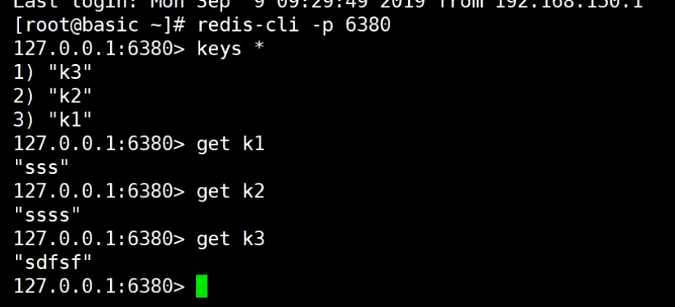

代理：twitter/twemproxy,predixy,cluster


数据分治：聚合操作，事务很难实现

安装：twemproxy ，教程地址：https://github.com/twitter/twemproxy

下载地址：https://github.com/twitter/twemproxy/archive/refs/tags/v0.4.1.zip


```
[root@hgq twemproxy]# autoreconf -fvi
autoreconf: Entering directory `.'
autoreconf: configure.ac: not using Gettext
autoreconf: running: aclocal --force -I m4
configure.ac:8: error: Autoconf version 2.64 or higher is required
configure.ac:8: the top level
```

```
#需要安装新版本的autoconf
[root@hgq twemproxy]# yum install autoconf
Loaded plugins: fastestmirror, security
Loading mirror speeds from cached hostfile
Setting up Install Process
Package autoconf-2.63-5.1.el6.noarch already installed and latest version
Nothing to do
#需要更新yum的仓库信息
[root@hgq twemproxy]# mv /etc/yum.repos.d/CentOS-Base.repo /etc/yum.repos.d/CentOS-Base.repo.backup
[root@hgq twemproxy]# wget -O /etc/yum.repos.d/CentOS-Base.repo https://mirrors.aliyun.com/repo/Centos-6.repo
[root@hgq yum.repos.d]# yum clean all
Loaded plugins: fastestmirror, security
Cleaning repos: base extras updates
Cleaning up Everything
Cleaning up list of fastest mirrors
[root@hgq yum.repos.d]# 
[root@hgq yum.repos.d]#  wget http://archives.fedoraproject.org/pub/archive/epel/6/x86_64/Packages/a/autoconf268-2.68-2.el6.noarch.rpm
[root@hgq soft]# rpm -e autoconf213-2.13-20.1.el6.noarch
```

```
[root@hgq twemproxy]# autoreconf268 -fvi
[root@hgq twemproxy]# ./configure 
[root@hgq twemproxy]# make
[root@hgq scripts]# cd /soft/twemproxy-0.4.1/scripts
[root@hgq scripts]# vi nutcracker.init

#! /bin/sh
#
# chkconfig: - 55 45
# description:  Twitter's twemproxy nutcracker
# processname: nutcracker
# config: /etc/sysconfig/nutcracker

# Source function library.
. /etc/rc.d/init.d/functions

USER="nobody"
OPTIONS="-d -c /etc/nutcracker/nutcracker.yml"

[root@hgq scripts]# cp nutcracker.init /etc/init.d/twemproxy
[root@hgq scripts]# cd /etc/init.d
-rw-r--r--. 1 root root  1467 7月  11 06:00 twemproxy
[root@hgq init.d]# chmod +x twemproxy
-rwxr-xr-x. 1 root root  1467 7月  11 06:00 twemproxy
[root@hgq init.d]# mkdir /etc/nutcracker
[root@hgq init.d]# cd /soft/twemproxy-0.4.1/conf
[root@hgq conf]# ls
nutcracker.leaf.yml  nutcracker.root.yml  nutcracker.yml
#复制配置文件
[root@hgq conf]# cp ./* /etc/nutcracker
[root@hgq conf]# cd /etc/nutcracker
[root@hgq nutcracker]# ls
nutcracker.leaf.yml  nutcracker.root.yml  nutcracker.yml
#修改配置文件
alpha:
  listen: 127.0.0.1:22121
  hash: fnv1a_64
  distribution: ketama
  auto_eject_hosts: true
  redis: true
  server_retry_timeout: 2000
  server_failure_limit: 1
  servers:
   - 127.0.0.1:6379:1
   - 127.0.0.1:6380:1
   

```

```
#分别在/data/6379和/data/6380目录下启动redis:
[root@hgq 6379]# redis-server --port 6379
[root@hgq 6380]# redis-server --port 6380
#启动nutcracker
[root@hgq ~]# service twemproxy start
正在启动 nutcracker：[确定]
[root@hgq ~]# service twemproxy status
nutcracker (pid 49319) 正在运行...
#停止twemproxy服务
[root@hgq ~]# service twemproxy stop
```

```
通过客户端访问redis代理服务器：
[root@hgq ~]# redis-cli -p 22121
127.0.0.1:22121> set k1 aaa
OK
127.0.0.1:22121> set k2 bbb
OK
127.0.0.1:22121> keys *
Error: Server closed the connection
127.0.0.1:22121> watch k1
Error: Server closed the connection

[root@hgq ~]# redis-cli -p 6380
127.0.0.1:6380> keys *
1) "k2"
2) "k1"

[root@hgq ~]# redis-cli -p 6379
127.0.0.1:6379> keys *
(empty array)
```


更新yum仓库信息：


重新通过yum搜索autoconf程序并安装

继续按照教程安装twemproxy 

修改可执行文件权限：


创建配置文件目录：


拷贝配置文件至etc的相应目录下：


将可执行程序复制到/usr/bin目录下：


修改配置文件：


在临时目录启动6379,6380这两台redis，启动redis代理


使用redis客户端连接redis代理：




代理不支持聚合命令，事务


安装predixy:https://github.com/joyieldInc/predixy/releases/tag/1.0.5


修改代理配置文件：

```
[root@hgq conf]# vim predixy.conf 
################################### SERVERS ####################################
# Include cluster.conf
 Include sentinel.conf
#Include try.conf
```

```
[root@hgq conf]# vim sentinel.conf 
SentinelServerPool {
    Databases 16
    Hash crc16
    HashTag "{}"
    Distribution modula
    MasterReadPriority 60
    StaticSlaveReadPriority 50
    DynamicSlaveReadPriority 50
    RefreshInterval 1
    ServerTimeout 1
    ServerFailureLimit 10
    ServerRetryTimeout 1
    KeepAlive 120
    Sentinels {
        + 127.0.0.1:26379
        + 127.0.0.1:26380
        + 127.0.0.1:26381
        
    }
    Group ooxx {
    }
    Group xxoo {
    }
```


复制配置：.,$y


然后按G到最后一行，按p粘贴配置，然后输入 .,$/#// 把#替换为空


修改哨兵配置：2dd删除两行，配置哨兵集群(一套哨兵集群可以监控一套或多套主从集群)

每个Group代表一套主从集群，通过hash算法决定数据进入那个主从集群


修改哨兵配置文件：26379.conf，26380.conf，26381.conf

```
[root@hgq test]# vi 26379.conf 
port 26379
sentinel monitor ooxx 127.0.0.1 36379 2
sentinel monitor xxoo 127.0.0.1 46379 2

[root@hgq test]# vi 26380.conf
port 26380
sentinel monitor ooxx 127.0.0.1 36379 2
sentinel monitor xxoo 127.0.0.1 46379 2

[root@hgq test]# vi 26381.conf
port 26381
sentinel monitor ooxx 127.0.0.1 36379 2
sentinel monitor xxoo 127.0.0.1 46379 2
```


启动哨兵服务：

```
[root@hgq test]# redis-server 26379.conf --sentinel

```


启动两套redis主从配置：

```
[root@hgq test]# mkdir 36379
[root@hgq test]# mkdir 36380
[root@hgq test]# mkdir 46379
[root@hgq test]# mkdir 46380

[root@hgq test]# cd 36379
[root@hgq 36379]# redis-server --port 36379
[root@hgq ~]# cd /test/36380
[root@hgq 36380]#
redis-server --port 36380 --replicaof 127.0.0.1 36379

[root@hgq ~]# cd /test/46379
[root@hgq 46379]# redis-server --port 46379
[root@hgq ~]# cd /test/46380
[root@hgq 46380]# redis-server --port 46380 --replicaof 127.0.0.1 46379
```


启动predixy代理：

```
[root@hgq predixy-1.0.5]# ls
bin  conf  doc  LICENSE  README_CN.md  README.md  test
[root@hgq predixy-1.0.5]# cd bin
[root@hgq bin]# ls
predixy
[root@hgq bin]# ./predixy ../conf/predixy.conf 
2021-07-11 07:14:14.460050 N Proxy.cpp:112 predixy listen in 0.0.0.0:7617
```


通过客户端连接代理：

```
[root@hgq ~]# redis-cli -p 7617
127.0.0.1:7617> set k1 haha
OK
127.0.0.1:7617> set k2 hello
OK
127.0.0.1:7617> keys *
(error) ERR unknown command 'keys'

[root@hgq ~]# redis-cli -p 36379
127.0.0.1:36379> keys *
1) "k1"

[root@hgq ~]# redis-cli -p 46379
127.0.0.1:46379> keys *
1) "k2"

#使用hash Tag让不同的key落入同一台机器上
127.0.0.1:7617> set {haha}k3 12
OK
127.0.0.1:7617> set {haha}k4 23423
OK
127.0.0.1:7617> watch {haha}k3
(error) ERR forbid transaction in current server pool

127.0.0.1:36379> keys *
1) "{haha}k4"
2) "k1"
3) "{haha}k3"
```


让两个key具有相同的hash Tag，这样可以这两个key落在同一套主从集群中


在多个主从复制下代理不支持事务：


修改predixy.conf，只保留一个主从复制，发现可以支持事务

```
SentinelServerPool {
    Databases 16
    Hash crc16
    HashTag "{}"
    Distribution modula
    MasterReadPriority 60
    StaticSlaveReadPriority 50
    DynamicSlaveReadPriority 50
    RefreshInterval 1
    ServerTimeout 1
    ServerFailureLimit 10
    ServerRetryTimeout 1
    KeepAlive 120
    Sentinels {
        + 127.0.0.1:26379
        + 127.0.0.1:26380
        + 127.0.0.1:26381

    }
    #只保留一个主从复制
    Group ooxx {
    }
    #Group xxoo {
    #}
```

```
#只保留一个主从复制可以支持事务
127.0.0.1:7617> watch {haha}k3
OK
127.0.0.1:7617> multi
OK
127.0.0.1:7617(TX)> get {haha}k4
QUEUED
127.0.0.1:7617(TX)> set k1 abc
QUEUED
127.0.0.1:7617(TX)> set k2 def
QUEUED
127.0.0.1:7617(TX)> exec
1) "23423"
2) OK
3) OK
127.0.0.1:7617> get k1
"abc"
127.0.0.1:7617> get k2
"def"
```


配置redis集群：


vi create-cluster

```
#!/bin/bash

# Settings
BIN_PATH="../../src/"
CLUSTER_HOST=127.0.0.1
PORT=30000
TIMEOUT=2000
NODES=6
REPLICAS=1
PROTECTED_MODE=yes
ADDITIONAL_OPTIONS=""

# You may want to put the above config parameters into config.sh in order to
# override the defaults without modifying this script.

if [ -a config.sh ]
then
    source "config.sh"
fi
```

```
#启动redis集群(3主3从)
[root@hgq create-cluster]# ./create-cluster start
Starting 30001
Starting 30002
Starting 30003
Starting 30004
Starting 30005
Starting 30006
#划分槽位
[root@hgq create-cluster]# ./create-cluster create
>>> Performing hash slots allocation on 6 nodes...
Master[0] -> Slots 0 - 5460
Master[1] -> Slots 5461 - 10922
Master[2] -> Slots 10923 - 16383
Adding replica 127.0.0.1:30005 to 127.0.0.1:30001
Adding replica 127.0.0.1:30006 to 127.0.0.1:30002
Adding replica 127.0.0.1:30004 to 127.0.0.1:30003
>>> Trying to optimize slaves allocation for anti-affinity
[WARNING] Some slaves are in the same host as their master
M: f9fed71c983159f30bf56c9ba64d56e3782abfea 127.0.0.1:30001
   slots:[0-5460] (5461 slots) master
M: ca5c6ab6d15031112ebb03b1516c639880f020ab 127.0.0.1:30002
   slots:[5461-10922] (5462 slots) master
M: 289add81b2a3f788d5f774c44ee6e4df8950140e 127.0.0.1:30003
   slots:[10923-16383] (5461 slots) master
S: eaa9dcf69f2d84c0ff6b9f3813d6a16a153adc46 127.0.0.1:30004
   replicates ca5c6ab6d15031112ebb03b1516c639880f020ab
S: 1c842192769a96cfc1c4b33221e9a93599d8cce4 127.0.0.1:30005
   replicates 289add81b2a3f788d5f774c44ee6e4df8950140e
S: 4307442864935ab80ec922936219de6e3d9f54b3 127.0.0.1:30006
   replicates f9fed71c983159f30bf56c9ba64d56e3782abfea
```


分槽位：


连接redis集群中的任何一台，尝试存入一个key，发现需要重定向到30003机器操作，使用redis-cli -c -p 30001启动则可以自动重定向

```
[root@hgq ~]# redis-cli -p 30001
127.0.0.1:30001> set k1 fadfasf
(error) MOVED 12706 127.0.0.1:30003
127.0.0.1:30001> 

[root@hgq ~]# redis-cli -c -p 30001
127.0.0.1:30001> set k1 adfsadfs
-> Redirected to slot [12706] located at 127.0.0.1:30003
OK
127.0.0.1:30003> get k1
"adfsadfs"
127.0.0.1:30003> set k2 hah
-> Redirected to slot [449] located at 127.0.0.1:30001
OK
127.0.0.1:30001> set k3 sdfsf
OK
127.0.0.1:30001> set hello 2343
OK
127.0.0.1:30001> keys *
1) "hello"
2) "k3"
3) "k2"
127.0.0.1:30001> watch k3
OK
127.0.0.1:30001> multi 
OK
127.0.0.1:30001(TX)> get k3
QUEUED
127.0.0.1:30001(TX)> exec
1) "sdfsf"

#事务无法跨机器执行
127.0.0.1:30001(TX)> set k1 sdfsfsf
-> Redirected to slot [12706] located at 127.0.0.1:30003
OK
127.0.0.1:30003> set k3 sdfsdf
-> Redirected to slot [4576] located at 127.0.0.1:30001
OK
127.0.0.1:30001> exec
(error) ERR EXEC without MULTI
```


使用相同的hash Tag让不同的key存入同一台机器，这样就可以成功执行事务了：

```
127.0.0.1:30001(TX)> set {haha}k1 12
QUEUED
127.0.0.1:30001(TX)> set {haha}k3 13
QUEUED
127.0.0.1:30001(TX)> exec
1) OK
2) OK
```


停止redis集群：


创建分布式集群：

```
[root@hgq create-cluster]# ./create-cluster start
[root@hgq create-cluster]# redis-cli --cluster create 127.0.0.1:30001 127.0.0.1:30002 127.0.0.1:30003 127.0.0.1:30004 127.0.0.1:30005 127.0.0.1:30006 --cluster-replicas 1
>>> Performing hash slots allocation on 6 nodes...
Master[0] -> Slots 0 - 5460
Master[1] -> Slots 5461 - 10922
Master[2] -> Slots 10923 - 16383
Adding replica 127.0.0.1:30005 to 127.0.0.1:30001
Adding replica 127.0.0.1:30006 to 127.0.0.1:30002
Adding replica 127.0.0.1:30004 to 127.0.0.1:30003
>>> Trying to optimize slaves allocation for anti-affinity
[WARNING] Some slaves are in the same host as their master
M: 33cd9744ca68a5ca5a6747fa079571175d0ba048 127.0.0.1:30001
   slots:[0-5460] (5461 slots) master
M: 53e5f1b1d43a9c20b54e2d7c770f6404f4c4e2c4 127.0.0.1:30002
   slots:[5461-10922] (5462 slots) master
M: 32cbf2c0891acaa53cb076c0837ae2f089c3d039 127.0.0.1:30003
   slots:[10923-16383] (5461 slots) master
S: f380a6f5a1c77ed45ab2dbe6d12f76ccbacb95f3 127.0.0.1:30004
   replicates 33cd9744ca68a5ca5a6747fa079571175d0ba048
S: eabba9651d9f0312c915b475827eacc951b9b8e2 127.0.0.1:30005
   replicates 53e5f1b1d43a9c20b54e2d7c770f6404f4c4e2c4
S: 00bdae9dd56ff853a3d123441aebcbfd8179cf15 127.0.0.1:30006
   replicates 32cbf2c0891acaa53cb076c0837ae2f089c3d039

```


移动槽位至某一台机器：

```
[root@hgq create-cluster]# redis-cli --cluster reshard 127.0.0.1:30001
>>> Performing Cluster Check (using node 127.0.0.1:30001)
M: 33cd9744ca68a5ca5a6747fa079571175d0ba048 127.0.0.1:30001
   slots:[0-5460] (5461 slots) master
   1 additional replica(s)
S: f380a6f5a1c77ed45ab2dbe6d12f76ccbacb95f3 127.0.0.1:30004
   slots: (0 slots) slave
   replicates 33cd9744ca68a5ca5a6747fa079571175d0ba048
M: 53e5f1b1d43a9c20b54e2d7c770f6404f4c4e2c4 127.0.0.1:30002
   slots:[5461-10922] (5462 slots) master
   1 additional replica(s)
S: 00bdae9dd56ff853a3d123441aebcbfd8179cf15 127.0.0.1:30006
   slots: (0 slots) slave
   replicates 32cbf2c0891acaa53cb076c0837ae2f089c3d039
S: eabba9651d9f0312c915b475827eacc951b9b8e2 127.0.0.1:30005
   slots: (0 slots) slave
   replicates 53e5f1b1d43a9c20b54e2d7c770f6404f4c4e2c4
M: 32cbf2c0891acaa53cb076c0837ae2f089c3d039 127.0.0.1:30003
   slots:[10923-16383] (5461 slots) master
   1 additional replica(s)
[OK] All nodes agree about slots configuration.
>>> Check for open slots...
>>> Check slots coverage...
[OK] All 16384 slots covered.

#准备将30001机器上的2000个槽位移到30003机器上
移动前:
M: 33cd9744ca68a5ca5a6747fa079571175d0ba048 127.0.0.1:30001
   slots:[0-5460] (3461 slots) master
M: 32cbf2c0891acaa53cb076c0837ae2f089c3d039 127.0.0.1:30003
   slots:[10923-16383] (7461 slots) master

[root@hgq create-cluster]# redis-cli --cluster reshard 127.0.0.1:30001
How many slots do you want to move (from 1 to 16384)? 2000
What is the receiving node ID? 32cbf2c0891acaa53cb076c0837ae2f089c3d039(30003节点id)
Please enter all the source node IDs.
  Type 'all' to use all the nodes as source nodes for the hash slots.
  Type 'done' once you entered all the source nodes IDs.
Source node #1: 33cd9744ca68a5ca5a6747fa079571175d0ba048
Source node #2: done
    Moving slot 3997 from 33cd9744ca68a5ca5a6747fa079571175d0ba048
    Moving slot 3998 from 33cd9744ca68a5ca5a6747fa079571175d0ba048
    Moving slot 3999 from 33cd9744ca68a5ca5a6747fa079571175d0ba048
Do you want to proceed with the proposed reshard plan (yes/no)? yes

移动后：
M: 33cd9744ca68a5ca5a6747fa079571175d0ba048 127.0.0.1:30001
   slots:[2000-5460] (3461 slots) master
   1 additional replica(s)
M: 32cbf2c0891acaa53cb076c0837ae2f089c3d039 127.0.0.1:30003
   slots:[0-1999],[10923-16383] (7461 slots) master
```


