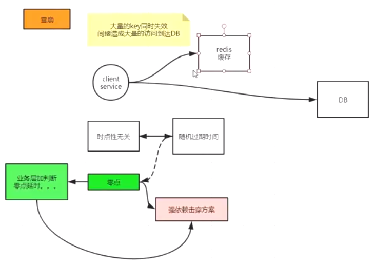

#### 击穿


#### 穿透


#### 雪崩



#### 分布式锁


#### redis客户端

##### jedis


特点：线程不安全，需要和pool配合使用

##### spring data redis

支持lettuce和jedis

单机，哨兵，主从读写分离

redisTemple,serializer

* config get * 可以获取redis的所有配置

```
127.0.0.1:6379> config get protected-mode
1) "protected-mode"
2) "yes"
127.0.0.1:6379> config set protected-mode no
OK
```

protected-mode：是否开启保护模式,临时修改保护模式：config set protected-mode no


demo:通过spring data redis操作redis：


redis是二进制安全的，存入redis前需要序列化为字节数组


redisTemplate发布订阅


