文件里面的数据：查询

grep awk  、java IO

#### 磁盘和内存速度对比

* 磁盘：

1.寻址：ms级

带宽：G/M

* 内存：

​	1.寻址：ns级

​	2.带宽：

秒>毫秒>微秒>纳秒

**磁盘在寻址上比内存慢10万倍**

I/O buffer:成本问题

磁盘有磁道、扇区，一扇区 512 Byte

如何知道数据存储在磁盘的某个位置，通过索引来查找，磁盘扇区小意味着需要建立更多的索引

对于索引来说：扇区越小，索引的成本越大

磁盘默认会格式化成4k的小的存储区域

磁盘读取会进行**4k对齐**，操作系统无论你读多少数据，都是以4k为单位读取

随着文件变大，读取文件速度变慢，原因是硬盘i/o成为瓶颈

数据库：

data page :4k  使用了4k的扇区存储数据

数据库索引是以4k为单位存储的

关系型数据库建表：必须给出schema(类型，字节宽度)

存储：倾向于以行为单位存储

在内存中构建B+tree用来查询

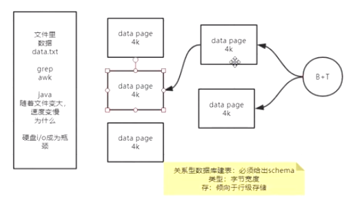

减少磁盘IO，以提高查询效率

**面试：数据库表很大的时候，则检索效率变低，这句话正确吗？**

​	如果表有索引，增删改(维护索引)变慢，

查询速度：

​	1.1个或少量查询，where可以命中索引，速度依然很快

​	2.并发大的时候会受磁盘带宽影响速度

SAP公司：HANA是内存级别的关系型数据库

数据在磁盘和内存体积不一样：磁盘没有指针的概念，内存可以多个指针指向同一对象

缓存：memcached,redis

计算机的2个基础设施：1.冯洛伊曼体系的硬件，硬件的限制2.以太网，Tcp/ip的网络，网络不稳定

架构师：技术选型，技术对比

数据库排名：https://db-engines.com/en/ranking

redis官网：redis-io

redis:并发15M ops/sec

用于数据库、缓存、消息中间件

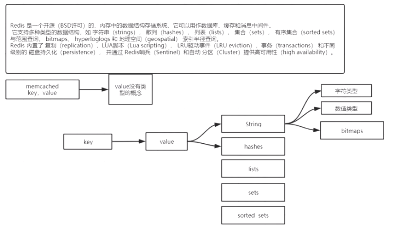

memcached:value没有数据类型，可以使用json存储复杂数据，redis的value有5种数据类型

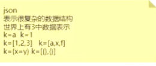

value类型的意义：

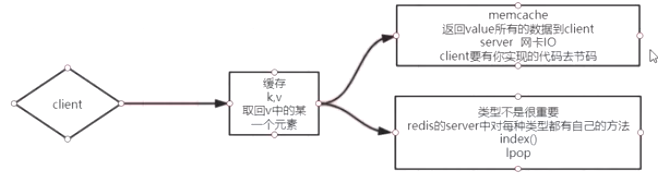

**计算向数据移动**

客户端访问memcached，取走全量的json，解析，取出需要的数据,计算发生在客户端

客户端访问redis,直接取走需要的数据，计算发生在redis server

磁盘的扇区大小：4k，实际情况是取决于上层应用的需要，比如视频录像的数据量很大，这样可以把扇区加大，减少寻址的次数，提高访问效率

环境：centos 6.x,redis 5.x

```shell
yum install wget
wget redis下载地址
```

```
make是linux下的编译命令，MakeFile提供编译信息
编译环境安装：yum gcc -y
```


readme.md:安装redis

MakeFile:  会进入src目录/Makefile 

编译:把源码编译成可执行程序

安装：文件copy

MakeFile:  

PREFIX:指定安装路径

PREFIX?=/usr/local表示如果没有指定安装路径，则以/usr/local为安装路径

make
报错:

需要安装gcc（linux的c语言编译器）

安装后，执行make，

报错：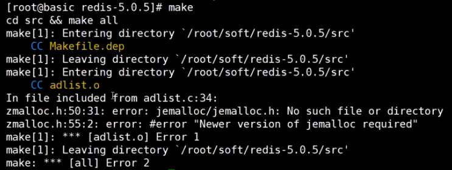

原因：上次执行make失败了，需要清理下

执行make distclean

再次执行make,成功

在src下，启动：redis-server

安装：

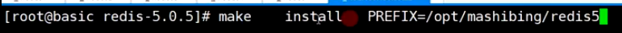

安装为系统的服务：

```
使用redis提供的install_server.sh将redis安装为系统的服务
install_server.sh需要知道redis的安装目录，因此，需要配置redis的环境变量
```


**vi /etc/profile**

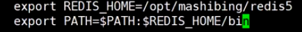

刷新配置：**source /etc/profile**

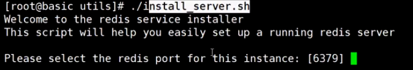

使用install_server.sh安装服务，通过端口号区分不同服务，配置目录，日志目录，数据目录

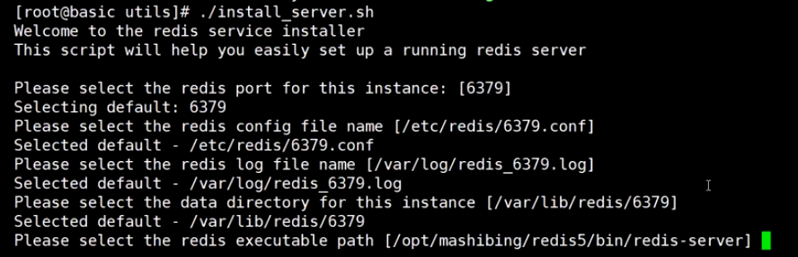

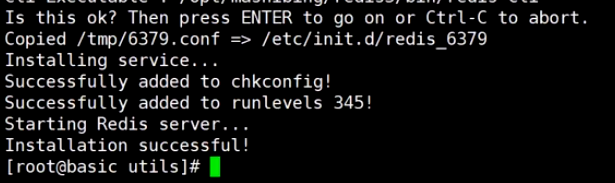

```
copied：把刚才指定的配置从临时目录拷贝到安装目录，

安装服务，把系统脚本安装到了etc的init.d目录下，

added to chkconfig:设置开启启动

added to runlevels 345:指定运行级别为345级别

启动redis
```


cd /etc/init.d 目录，

vi  redis_6379

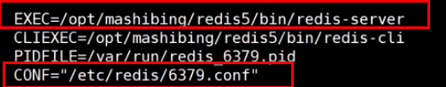

启动redis服务：

service redis_6379 start

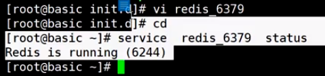

再创建一个redis实例：

/utils目录下，重复上述步骤

查看redis进程：

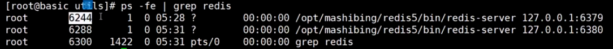

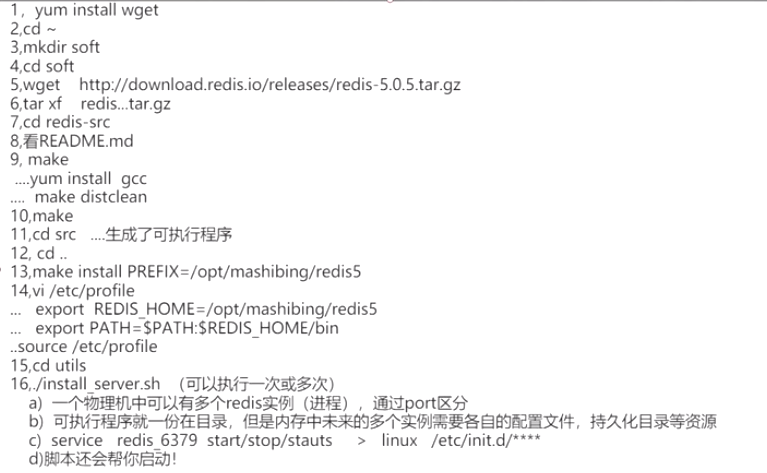

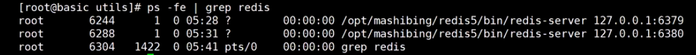

redis：单进程，单线程，单实例

并发很多的请求，如何变得很快的呢？

redis：使用了epoll系统调用

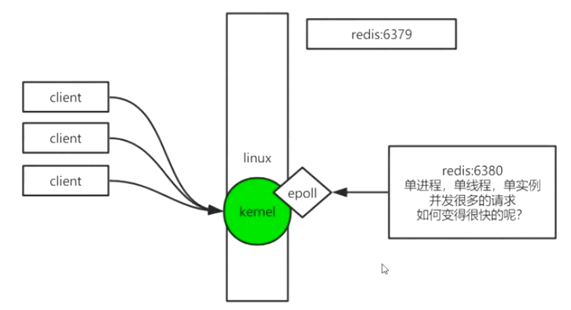

BIO:

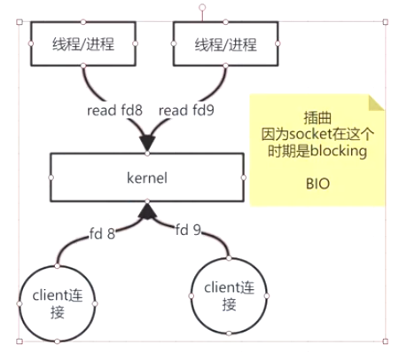

yum install man（帮助命令） man-pages(所有帮助页)  

man man-pages

```
man可以查看8类命令帮助
2 系统调用
man 2 read 查看read系统调用
任何进程都有文件描述符
```

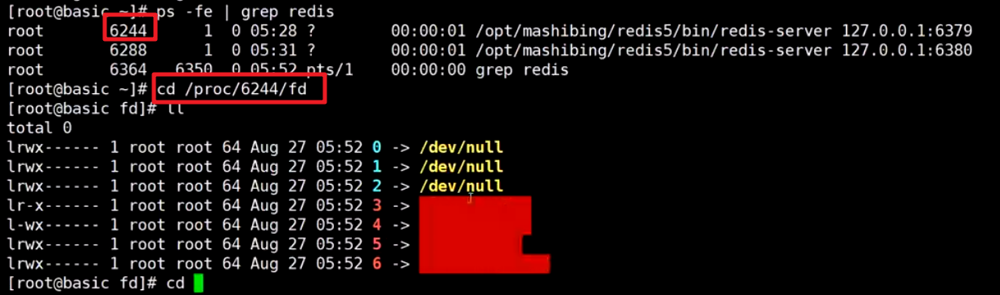

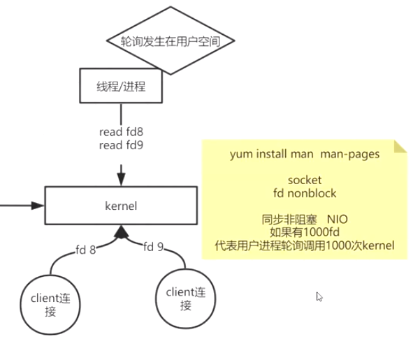

```
NIO的缺点：如果有1000fd，用户程序需要遍历所有的fd，每个客户端连接读取一次都要发生一次系统调用，因此有了select系统调用，select系统调用可以实现一次读取一批fd
```

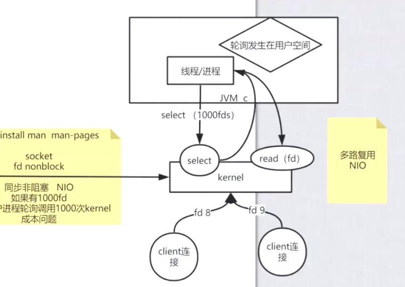

```
select的缺点：每次批量去询问操作系统可操作的fd，fd相关数据在用户态和内核态之间来回拷贝，但是实际上每次只有一部分fd是需要处理的，
因此有了epoll系统调用，以及共享空间(mmap用户态和内核态都可以访问)
epoll: 系统函数<epoll_create,epoll_ctl,epoll_wait>,用户空间和内核空间通过内存映射(mmap)共享一块内存，用户程序将fd存入共享空间，这些fd对操作系统也是可见的，fd的存储结构是红黑树结构，当系统发现有fd可以操作了，则把这个fd放入链表中，这样用户程序就可以直接读取可操作的fd，从而减少fd的来回拷贝的成本，并且只需要关心链表中可操作的fd就可以了
```

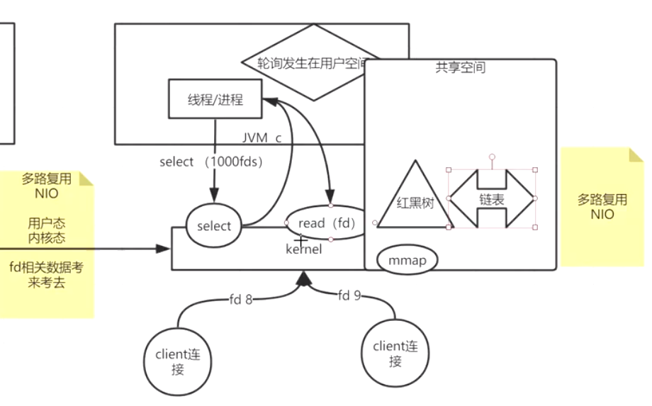

kafka的底层原理：

kafka是基于零拷贝技术，在Linux底层对应的是sendfile和mmap

一般情况下：将消息从一个fd1写入另一个fd2需要经历的过程是调用操作系统的read函数读取fd1的内容(用户态内核态切换，操作系统返回数据，数据从内核空间拷贝到用户空间)，再调用操作系统的write函数(用户态内核态切换，用户空间的数据拷贝到内核空间，内核再将数据拷贝到fd2)，这样的话从fd1传输数据到fd2经历了两次系统调用，两次数据拷贝，效率较低，而sendfile可以实现零拷贝

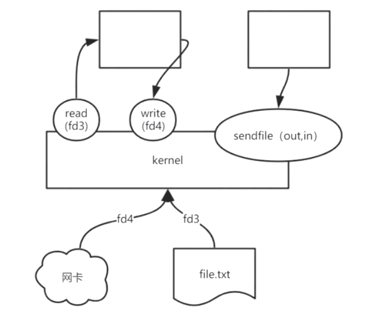

当生产者将消息通过网关发送过来，kafka接收到消息，通过mmap将消息内容直接写入共享空间，再通过操作系统将共享空间的数据写入文件，不需要用户态到内核态的数据拷贝，而消息者获取消息时，数据从文件拷贝到共享空间，再通过sendfile系统调用直接写入消息者连接的fd

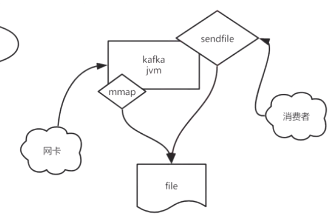

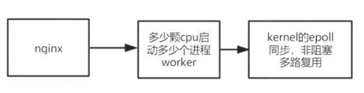

