##### list

链表：双向链表

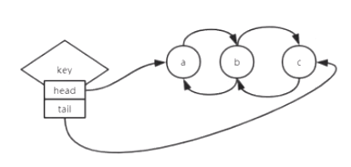

key：对象中存储了head、tail；

help @list

lpush :从链表的左边开始放

rpush:从链表的右边开始放

lpop :从左边弹出一个元素

lrange: 查看指定范围的数据

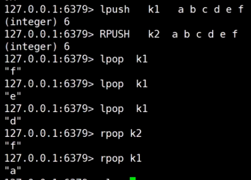

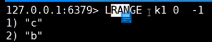

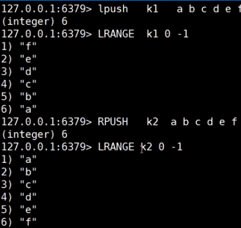

lindex:根据索引取出元素

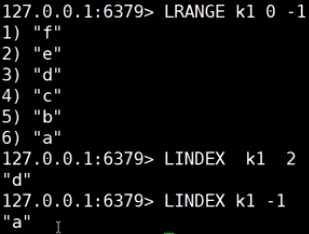

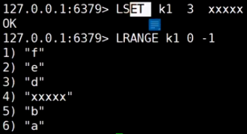

LREM  key  count  value:移除元素

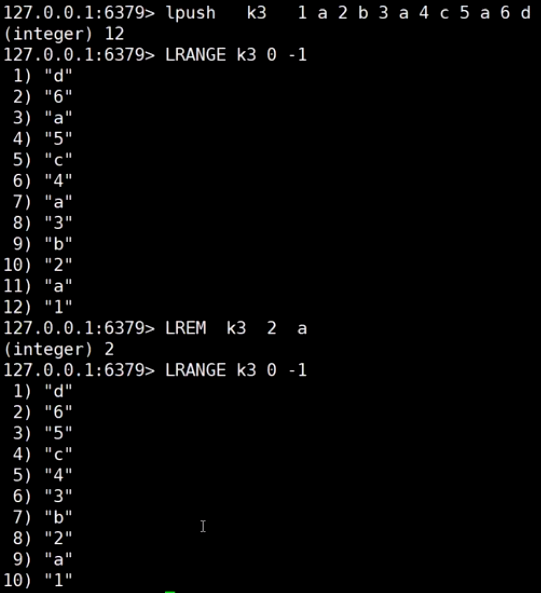

LINSERTl   key after oldvalue value:插入数据

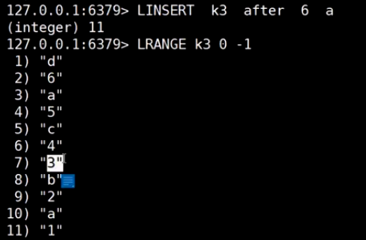

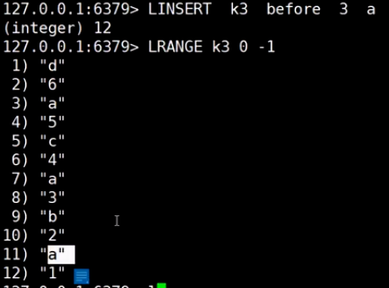

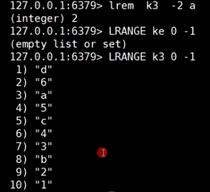

BLPOP:阻塞弹出元素，实现阻塞队列

开启三个客户端，

第一个和第二个客户端，输入
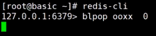

客户端1和客户端2都被阻塞住，等待数据返回，

客户端3 push一个数据，

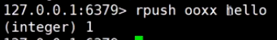

客户端1此时获取到数据：

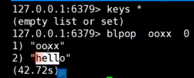

客户端2继续阻塞，

然后客户端3继续push一个数据：

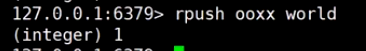

客户端2获取到数据：

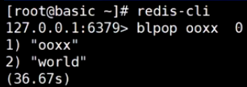

LTRIM:截取list集合的指定范围元素，其他元素删除

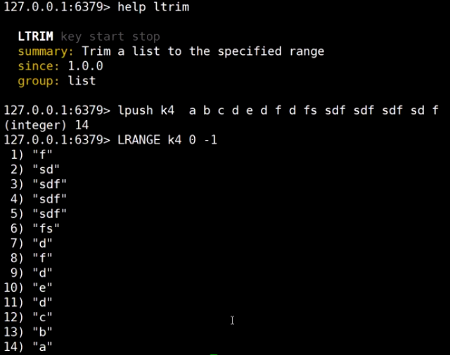

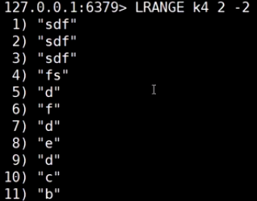

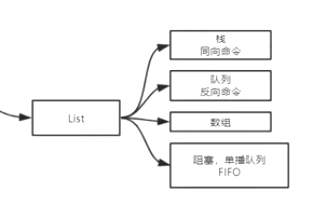

##### hash

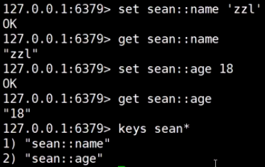

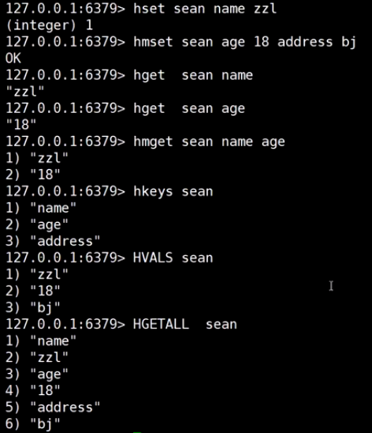

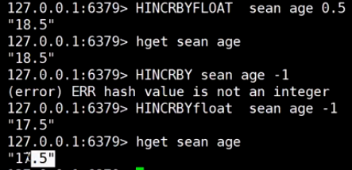

##### SET

help @set

SMEMBERS key:获取所有的value，会影响性能

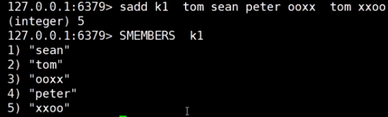

sinter：取多个key的交集

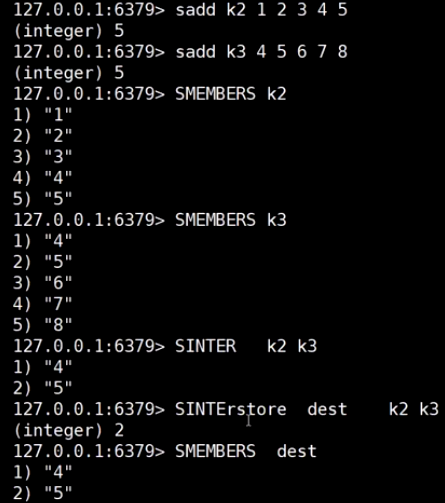

sunion：取并集

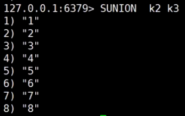

sdiff:取差集

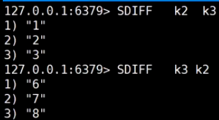

srandmember:取多个随机值

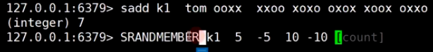

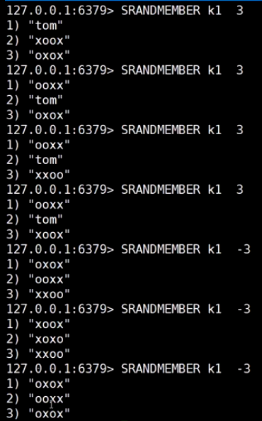

spop key :随机弹出一个值

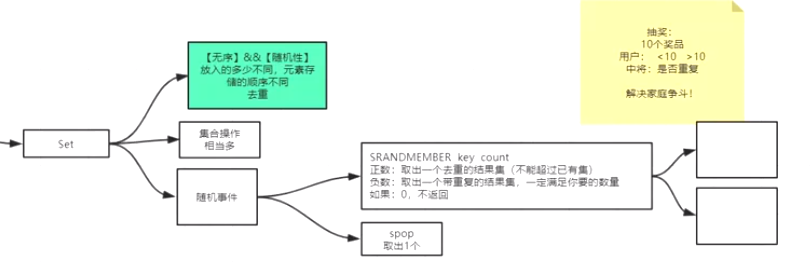

##### sorted set

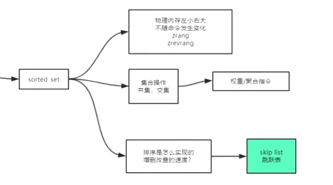

物理内存：按照左小右大的顺序，不会随着命令发生变化

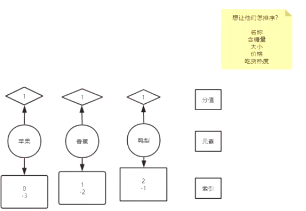

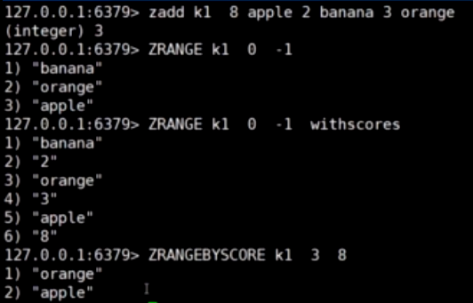

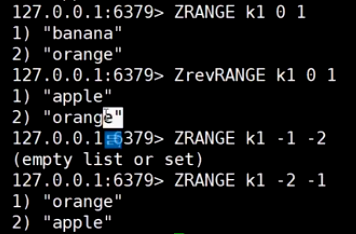

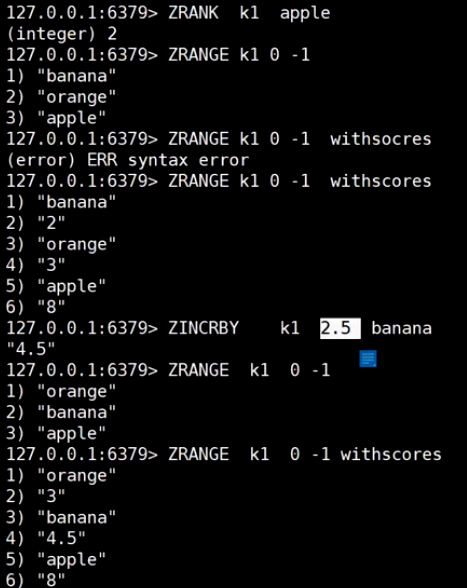

场景：歌曲排行榜

点击量：开始为0，当用户访问时，更新点击量的分数

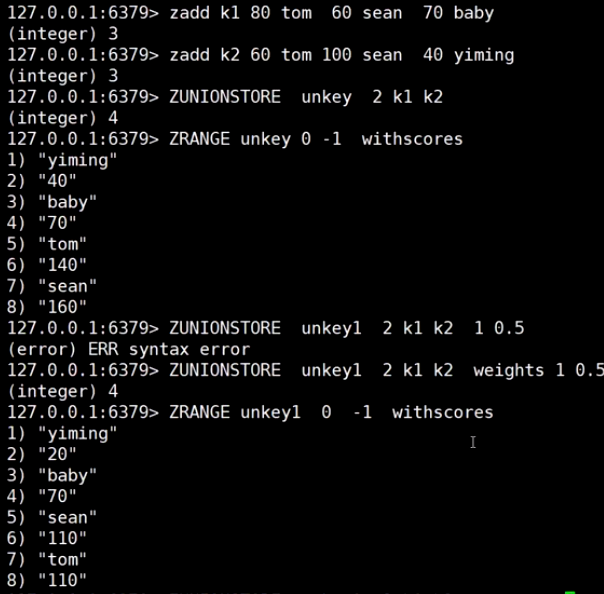

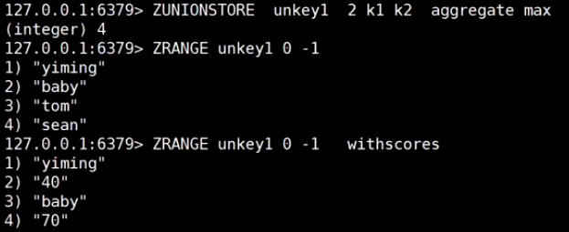

**sorted set 底层原理**

skip list:跳跃表：类平衡树

当数据量很大，增删改查的平均值相对最优

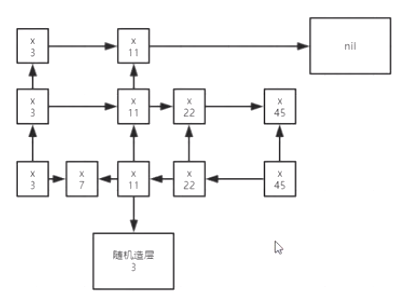

